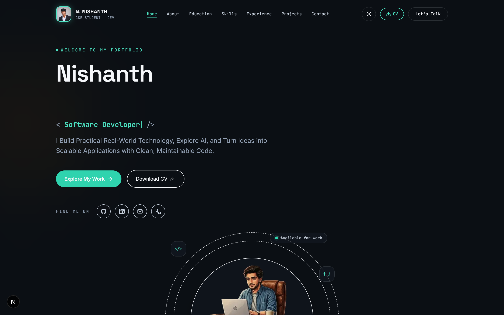
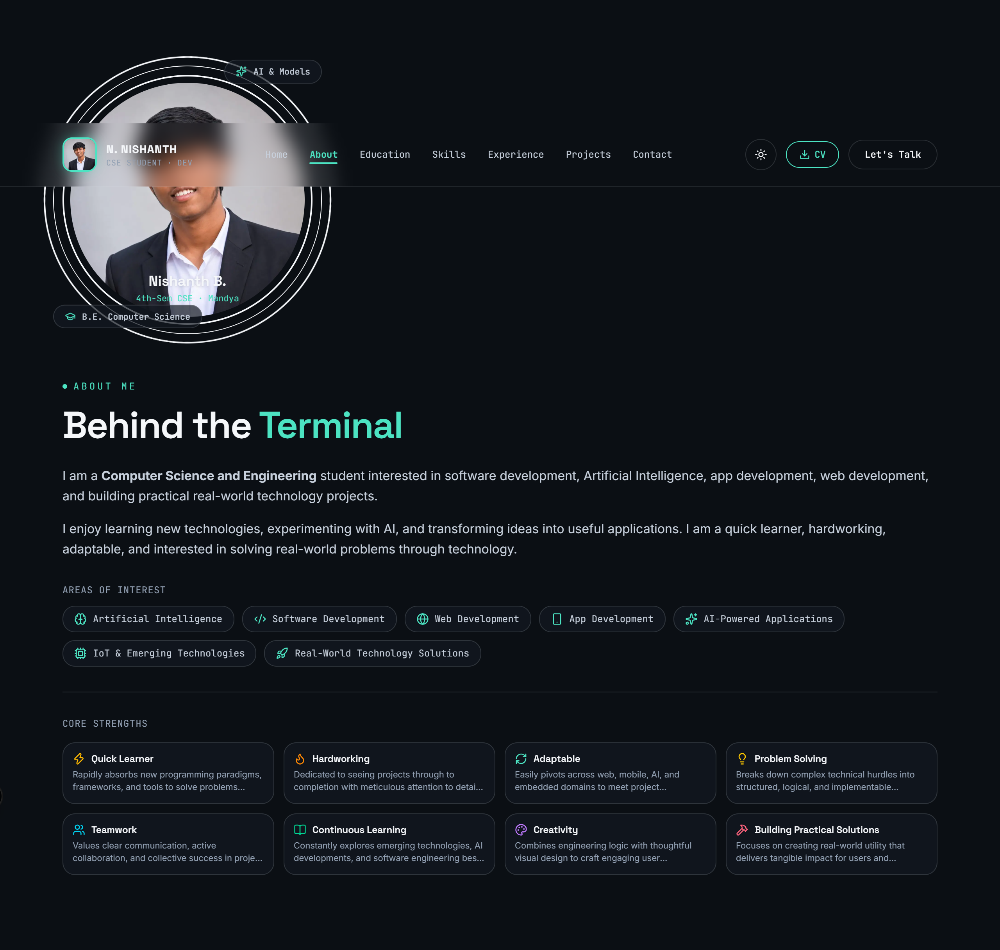
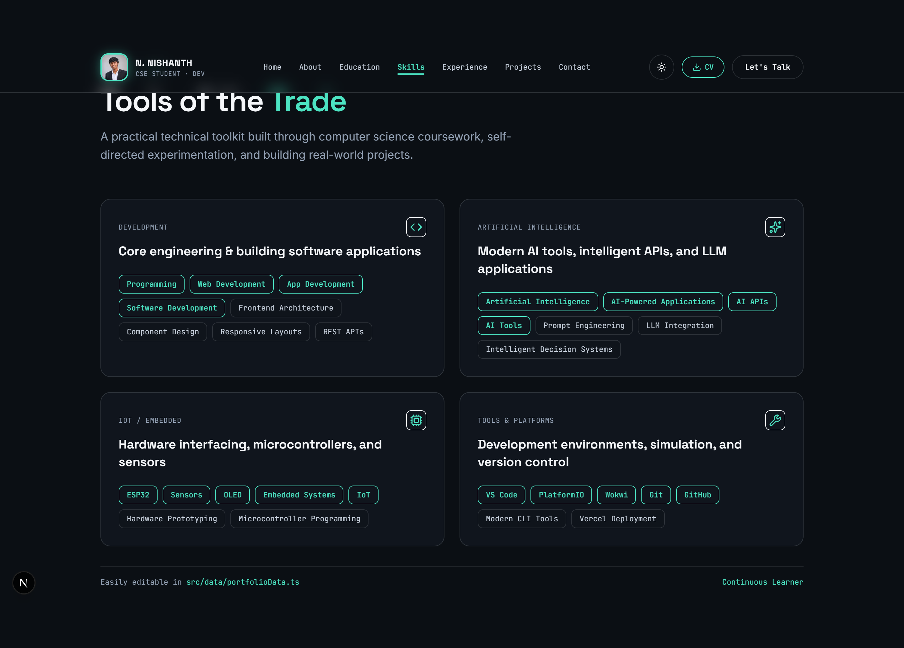
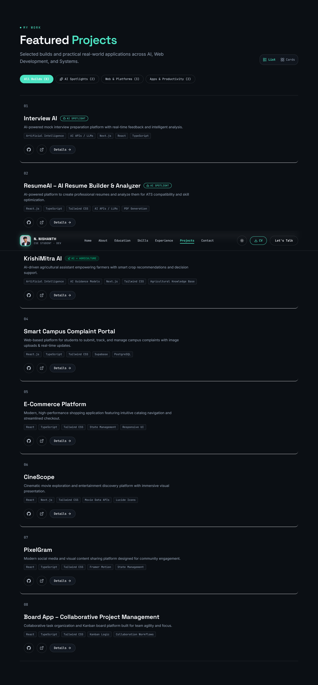
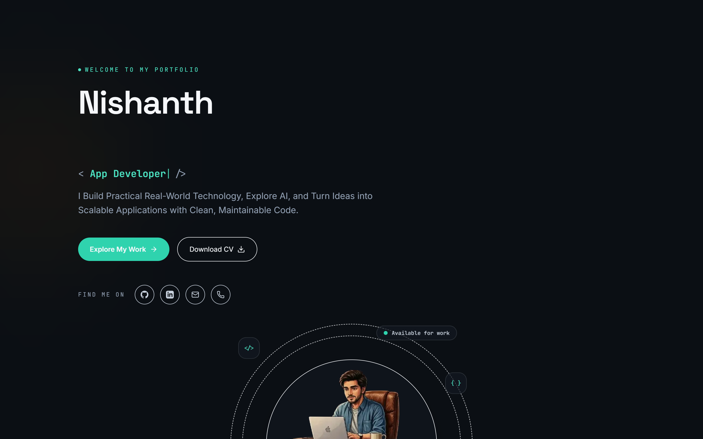
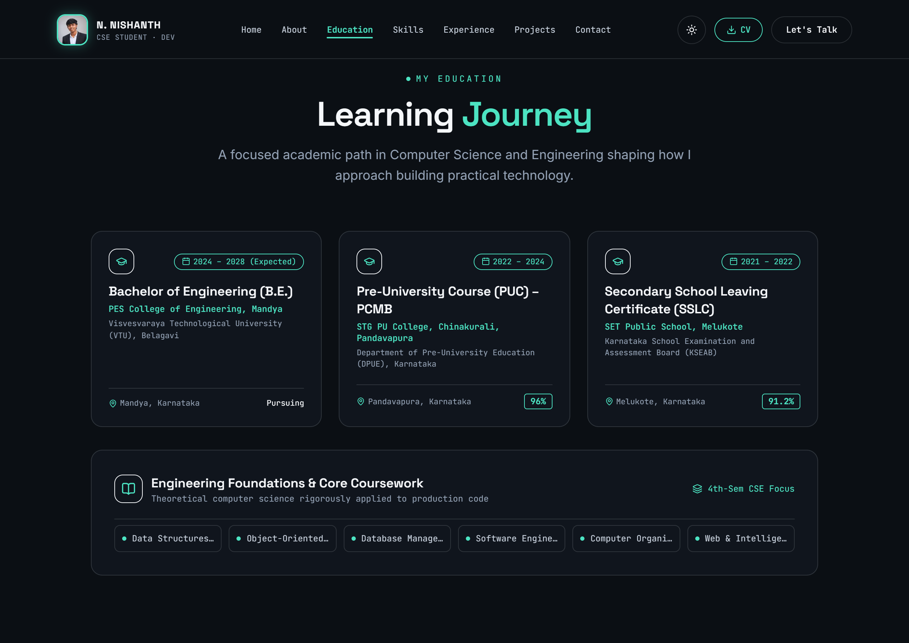
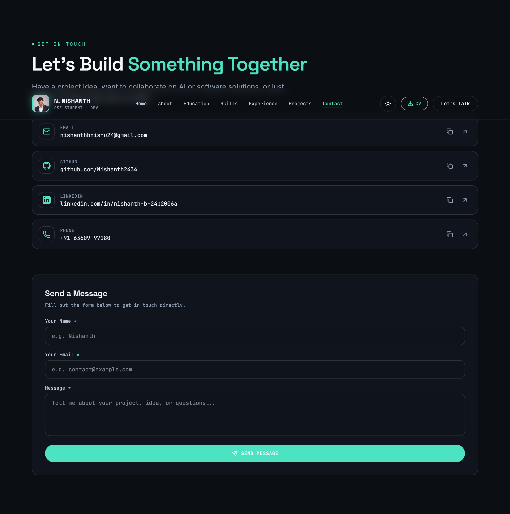
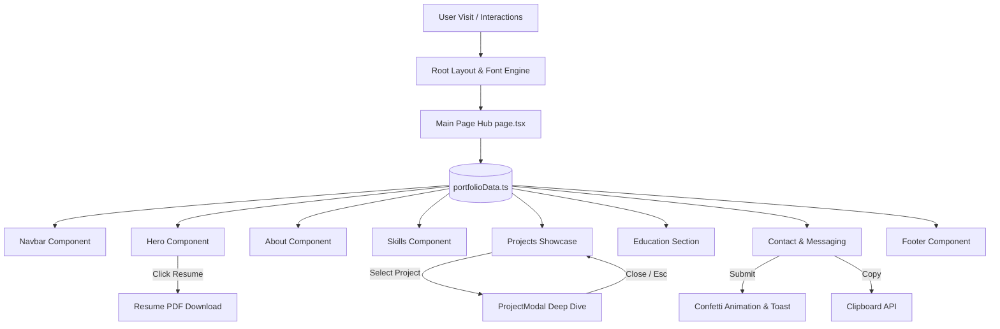

<p align="center">
  
</p>

<h1 align="center">Nishanth B — Full-Stack & AI Developer Portfolio</h1>

<p align="center">
  <strong>A modern, high-performance developer portfolio showcasing production full-stack web applications, AI-driven platforms, and interactive engineering experiences.</strong>
</p>

<p align="center">
  <a href="https://github.com/Nishanth2434/portfolio/stargazers"></a>
  <a href="https://portfolio-three-beige-83.vercel.app"></a>
  <a href="https://nextjs.org"></a>
  <a href="https://react.dev"></a>
  <a href="https://www.typescriptlang.org"></a>
  <a href="https://tailwindcss.com"></a>
  <a href="LICENSE"></a>
  <a href="https://github.com/Nishanth2434/portfolio/pulls"></a>
</p>

---

<p align="center">
  <a href="https://portfolio-three-beige-83.vercel.app" target="_blank">
    
  </a>
</p>

<p align="center">
  <a href="#-a-look-inside--live-interface-screenshots">📸 Live Screenshots</a> &nbsp;•&nbsp;
  <a href="#-core-highlights--capabilities">✨ Highlights</a> &nbsp;•&nbsp;
  <a href="#-featured-projects-directory">🚀 8 Featured Projects</a> &nbsp;•&nbsp;
  <a href="#%EF%B8%8F-comprehensive-tech-stack">🛠️ Tech Stack</a> &nbsp;•&nbsp;
  <a href="#%EF%B8%8F-architecture--component-flow">🏗️ Architecture</a> &nbsp;•&nbsp;
  <a href="#-getting-started-locally">💻 Setup</a> &nbsp;•&nbsp;
  <a href="#-author--contact">📬 Contact</a>
</p>

---

## 📸 A Look Inside — Live Interface Screenshots

<p align="center">
  
</p>

<table>
  <tr>
    <td width="50%" align="center" valign="top">
      
      <br /><br />
      <strong>👤 About & Engineering Philosophy</strong>
      <p>Interactive biography, core engineering background, statistics, and career focus.</p>
    </td>
    <td width="50%" align="center" valign="top">
      
      <br /><br />
      <strong>⚡ Technical Arsenal & Categorized Skills</strong>
      <p>Proficiency matrix across Web Dev, AI Integration, IoT/Embedded hardware, and Developer Tools.</p>
    </td>
  </tr>
  <tr>
    <td width="50%" align="center" valign="top">
      
      <br /><br />
      <strong>🚀 Production Projects Grid & Dynamic Filtering</strong>
      <p>Filterable project cards with category tabs, live demo links, source code repositories, and feature tags.</p>
    </td>
    <td width="50%" align="center" valign="top">
      
      <br /><br />
      <strong>🔍 Deep-Dive Project Modal Case Study</strong>
      <p>Comprehensive breakdown of problem statement, architectural solution, core features, and live preview.</p>
    </td>
  </tr>
  <tr>
    <td width="50%" align="center" valign="top">
      
      <br /><br />
      <strong>🎓 Academic Journey & Education</strong>
      <p>B.E. in Computer Science & Engineering academic roadmap, coursework, and milestones.</p>
    </td>
    <td width="50%" align="center" valign="top">
      
      <br /><br />
      <strong>📬 Direct Messaging & Social Connect</strong>
      <p>Instant inquiry form with validation, celebratory animations, 1-click clipboard copy, and direct channels.</p>
    </td>
  </tr>
</table>

---

## ✨ Core Highlights & Capabilities

<table>
  <tr>
    <td width="33%" valign="top">
      <h3>🎨 Futuristic Obsidian Aesthetic</h3>
      <p>Sleek dark theme (<code>#060913</code>) featuring subtle radial gradient meshes, ambient grid patterns, and ultra-smooth glassmorphic cards (<code>backdrop-blur-md</code>).</p>
    </td>
    <td width="33%" valign="top">
      <h3>🚀 8 Production-Ready Projects</h3>
      <p>Showcases 8 end-to-end full-stack applications and AI products spanning campus governance, generative AI interview prep, agricultural advisory, and agile boards.</p>
    </td>
    <td width="33%" valign="top">
      <h3>🔍 Interactive Project Modals</h3>
      <p>Clicking any project card reveals an in-depth case study detailing the <em>Problem Statement</em>, <em>Technical Solution</em>, <em>Key Capabilities</em>, and direct links.</p>
    </td>
  </tr>
  <tr>
    <td width="33%" valign="top">
      <h3>⚡ Real-Time Category Filtering</h3>
      <p>Instant zero-reload tab switching across <em>All Projects</em>, <em>AI & Smart Systems</em>, <em>Web & Platforms</em>, and <em>Apps & Productivity</em>.</p>
    </td>
    <td width="33%" valign="top">
      <h3>📄 Instant Resume & CV Download</h3>
      <p>Direct 1-click access to download Nishanth's verified PDF resume, complete with comprehensive academic and technical credentials.</p>
    </td>
    <td width="33%" valign="top">
      <h3>📱 Mobile-First Responsive Design</h3>
      <p>Fluid layouts optimized across smartphones, tablets, laptops, and ultra-wide desktop monitors with a slide-out mobile drawer navigation.</p>
    </td>
  </tr>
</table>

<details>
  <summary><b>View Advanced Interactive Features</b></summary>
  <br />

  - **Typewriter Animated Title**: Dynamic role cycling between *"Full Stack Developer"*, *"AI & ML Enthusiast"*, and *"Software Engineer"*.
  - **Live Availability Pill**: Real-time status indicator signaling readiness for software engineering roles and internships.
  - **1-Click Clipboard Utilities**: One-tap copying for email (<code>nishanthbnishu24@gmail.com</code>) and phone (<code>+91 6360997180</code>) with animated visual feedback.
  - **Confetti Celebration Form**: Interactive contact form with client-side validation and celebration effects upon successful message submission.
  - **Sticky Glass Navbar with Scroll Spy**: Automatically detects the active viewport section and highlights the corresponding navigation tab.
</details>

---

## 🚀 Featured Projects Directory

A directory of 8 production-grade applications engineered by Nishanth B.:

| # | Project Name | Category | Core Tech Stack | Live Demo | Source Code |
|---|---|---|---|---|---|
| 1 | **Smart Campus Complaint Portal** | Campus Management / Full-Stack | Next.js, Supabase, Tailwind CSS, TypeScript | [🌐 Live Demo](https://smart-campus-complaint.vercel.app) | [💻 GitHub Repo](https://github.com/Nishanth2434/Smart-campus-complaint) |
| 2 | **Interview AI** | Generative AI / EdTech | Next.js, OpenAI / Gemini, TypeScript, Tailwind | [🌐 Live Demo](https://interview-ai-six-blue.vercel.app) | [💻 GitHub Repo](https://github.com/Nishanth2434/Interview-AI) |
| 3 | **KrishiMitra AI (Rytha Seva)** | AgriTech / AI Assistant | React, Node.js, AI Vision & Prediction APIs | [🌐 Live Demo](https://rytha-seva.vercel.app) | [💻 GitHub Repo](https://github.com/Nishanth2434/Rytha-seva) |
| 4 | **E-Commerce Platform** | Full-Stack E-Commerce | React, Redux, Stripe Integration, Tailwind CSS | [🌐 Live Demo](https://e-commerce-sigma-ten-84.vercel.app) | [💻 GitHub Repo](https://github.com/Nishanth2434/E-commerce) |
| 5 | **CineScope TV Discovery** | Entertainment & Media | React, TMDB API, Tailwind CSS, Framer Motion | [🌐 Live Demo](https://cine-scope-tan.vercel.app/) | [💻 GitHub Repo](https://github.com/Nishanth2434/CineScope-TV-Discovery-App) |
| 6 | **PixelGram** | Social Media Platform | React, Firebase / Cloudinary, Tailwind CSS | [🌐 Live Demo](https://pixelgram-omega.vercel.app) | [💻 GitHub Repo](https://github.com/Nishanth2434/pixelgram) |
| 7 | **Board App — Project Management** | Productivity & Collaboration | Next.js, dnd-kit, Real-Time Sync, Tailwind | [🌐 Live Demo](https://board-app-snowy.vercel.app/) | [💻 GitHub Repo](https://github.com/Nishanth2434/board-app) |
| 8 | **ResumeAI — Resume Analyzer** | AI Career Tools | Next.js, AI Analysis Engine, PDF Generation | [🌐 Live Demo](https://resume-ai-azure-two.vercel.app) | [💻 GitHub Repo](https://github.com/Nishanth2434/Resume-AI) |

---

## 🛠️ Comprehensive Tech Stack

| Layer | Technologies | Description / Role |
|---|---|---|
| **Framework** | Next.js 16 (App Router) | High-performance React framework with server rendering & optimal routing |
| **Language** | TypeScript 5 | End-to-end static type safety, interfaces, and strict prop contracts |
| **Styling** | Tailwind CSS v4 | Modern utility-first CSS engine with dark mode obsidian accents |
| **Icons & Media** | Lucide React | Clean, scalable modern vector icon set across all interactive UI components |
| **Animation & Effects** | Canvas Confetti, CSS Keyframes | Fluid micro-interactions, gradient glow transitions, and typewriter loops |
| **State Management** | React 19 Hooks (`useState`, `useEffect`, `useMemo`) | Fast client-side filtering, active scroll monitoring, and modal management |
| **Deployment** | Vercel Edge Network | Automated Git CI/CD deployment with global edge CDN caching and SSL |

---

## 🏗️ Architecture & Component Flow

```
[ User Browser / Device ]
           │
           ▼
  ┌────────────────────────────────────────────────────────┐
  │              Next.js 16 App Router (layout.tsx)         │
  │  - Root HTML & Viewport Configuration                  │
  │  - Inter & Space Grotesk Google Font Loading            │
  │  - Ambient Grid & Obsidian Background Canvas           │
  └────────────────────────────────────────────────────────┘
                             │
            ┌────────────────┴────────────────┐
            ▼                                 ▼
  ┌───────────────────┐             ┌───────────────────┐
  │ Sticky Glass Nav  │             │ Single-Page Feed  │
  │ - Scroll Spy      │             │ (page.tsx)        │
  │ - Mobile Drawer   │             └─────────┬─────────┘
  │ - Quick Nav Links │                       │
  └───────────────────┘                       ▼
                    ┌─────────────────────────────────────────┐
                    │ 1. Hero: Avatar, Typewriter, CTA        │
                    │ 2. About: Bio, Stats, Strengths Grid    │
                    │ 3. Skills: 4-Category Matrix            │
                    │ 4. Projects: Filter + 8 Project Cards   │
                    │ 5. ProjectModal: Deep-Dive Case Study   │
                    │ 6. Education: B.E. CSE Timeline         │
                    │ 7. Contact: Direct Messaging + Handles  │
                    │ 8. Footer: Back-to-top & Social links   │
                    └─────────────────────────────────────────┘
```

### Component & Data Flow Diagram



---

## 📁 Project Structure

```
nishanth-portfolio/
├── docs/
│   ├── logo.png                     # Profile avatar & repository brand asset
│   └── screenshots/
│       ├── home.png                 # Hero showcase banner
│       ├── about.png                # About & stats section
│       ├── skills.png               # Skills & competencies matrix
│       ├── projects.png             # Filterable projects grid
│       ├── project-modal.png        # In-depth project case study modal
│       ├── education.png            # Academic roadmap & education
│       └── contact.png              # Direct contact & inquiry channels
├── public/
│   ├── logo.png                     # Public website logo
│   ├── profile.jpg                  # High-resolution hero & navbar photo
│   └── Nishanth_B_Resume.pdf        # Downloadable verified resume
├── src/
│   ├── app/
│   │   ├── globals.css              # Obsidian theme, ambient mesh & animations
│   │   ├── layout.tsx               # Root layout & SEO metadata
│   │   └── page.tsx                 # Master single-page assembly
│   ├── components/
│   │   ├── Navbar.tsx               # Glassmorphic navbar with active scroll spy
│   │   ├── Hero.tsx                 # Typewriter hero, live badge, and action CTAs
│   │   ├── About.tsx                # Engineering philosophy, bio, and stat highlights
│   │   ├── Skills.tsx               # Categorized proficiency matrix
│   │   ├── Projects.tsx             # 8 Projects grid with dynamic category filters
│   │   ├── ProjectModal.tsx         # Comprehensive project case study dialog
│   │   ├── Education.tsx            # Academic milestone & CSE credentials
│   │   ├── Contact.tsx              # Interactive contact form & 1-click copy handles
│   │   ├── Footer.tsx               # Social links, copyright, and scroll-to-top
│   │   └── icons.tsx                # Custom brand icons (GitHub, LinkedIn)
│   └── data/
│       ├── portfolioData.ts         # Centralized profile, project records, and contact details
│       └── types.ts                 # TypeScript data interfaces
├── package.json
├── tsconfig.json
└── README.md
```

---

## 💻 Getting Started Locally

### Prerequisites

- **Node.js**: v18.18.0 or higher
- **Package Manager**: `npm`, `pnpm`, or `yarn`

### Installation

1. **Clone the repository:**
   ```bash
   git clone https://github.com/Nishanth2434/portfolio.git
   cd portfolio
   ```

2. **Install dependencies:**
   ```bash
   npm install
   ```

3. **Run the local development server:**
   ```bash
   npm run dev
   ```

4. **Open your browser:**
   Visit `http://localhost:3000` to preview your local instance.

### Production Build

To test the production build locally:

```bash
npm run build
npm run start
```

---

## ✏️ Customizing Portfolio Data

All project definitions, profile information, and contact links are cleanly decoupled in:
👉 [`src/data/portfolioData.ts`](src/data/portfolioData.ts)

- **Personal Details**: Update `PERSONAL_INFO` (name, titles, bio, location).
- **Projects**: Add, remove, or modify items in `PROJECTS` (live demo, GitHub repo, tags, problem/solution).
- **Skills Matrix**: Update `SKILL_CATEGORIES` to append new frameworks, libraries, or tools.
- **Contact Details**: Update `CONTACT_CHANNELS` with new social channels or phone numbers.

---

## 🚀 Deploying to Vercel

This repository is optimized for one-click deployment on [Vercel](https://vercel.com):

1. Push your changes to GitHub:
   ```bash
   git add .
   git commit -m "feat: customize portfolio content"
   git push origin main
   ```
2. Go to [Vercel Dashboard](https://vercel.com) and click **"Add New..."** > **"Project"**.
3. Import your `portfolio` repository.
4. Framework preset will automatically be detected as **Next.js**.
5. Click **Deploy**. Your portfolio will be live worldwide in seconds!

---

## 👤 Author & Contact

**Nishanth B**  
*Computer Science & Engineering Student & Full-Stack / AI Developer*  
Mandya, Karnataka, India

- 🌐 **Live Portfolio**: [portfolio-three-beige-83.vercel.app](https://portfolio-three-beige-83.vercel.app)
- 📧 **Email**: [nishanthbnishu24@gmail.com](mailto:nishanthbnishu24@gmail.com)
- 🐙 **GitHub**: [@Nishanth2434](https://github.com/Nishanth2434)
- 💼 **LinkedIn**: [Nishanth B Profile](https://www.linkedin.com/public-profile/settings/?lipi=urn%3Ali%3Apage%3Ad_flagship3_profile_self_edit_contact_info%3Bb2xb%2FHMiTFGfXAGBW3KYCQ%3D%3D)
- 📱 **Phone**: [+91 6360997180](tel:+916360997180)

---

## 📄 License

This project is licensed under the [MIT License](LICENSE) — feel free to use it as inspiration for your own portfolio!

<p align="center">
  Made with ❤️ by <a href="https://github.com/Nishanth2434">Nishanth B</a>
</p>
